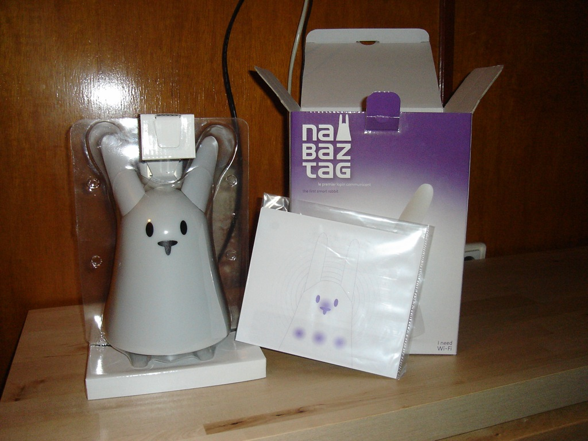
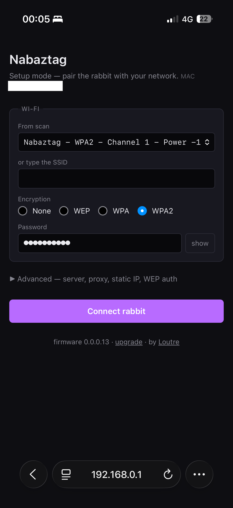
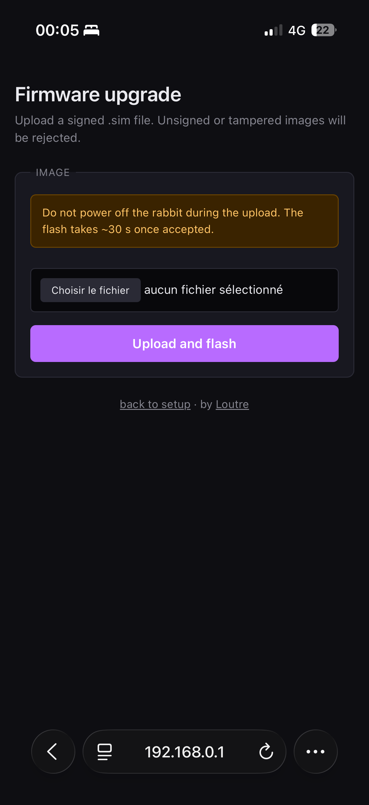

<p align="center">
  
  &nbsp;&nbsp;&nbsp;
  
</p>

<h1 align="center">Nabaztag&nbsp;&nbsp;×&nbsp;&nbsp;Home Assistant</h1>

<p align="center">
  <strong>Bring the 2006 Wi-Fi rabbit back to life — and let it talk to Claude.</strong><br>
  <sub>100&nbsp;% local · no cloud · no account. The Violet servers died in 2011; this is its new home.</sub>
</p>

<p align="center">
  <a href="LICENSE"></a>
  
  
  
  
  
  
</p>

<p align="center">
  
  
  
  
  
  
  <br><sub>every capability above verified live on a real Nabaztag:tag&nbsp;v2 🐰</sub>
</p>

Bring an **original Nabaztag** (the 2005–2006 Wi-Fi rabbit by Violet/Mindscape)
back to life and drive it from **Home Assistant**, fully locally — no cloud.

This repository is a **Home Assistant OS add-on repository**. Its primary add-on
is a small, **dependency-free server that speaks the original Violet protocol**
directly: the rabbit phones home to it (the real Violet servers died around
2011), and Home Assistant drives the rabbit — ears, belly weather icons, nose —
through a simple control API.

### ✨ Highlights

- 🐰 **Revives a 2006 rabbit** with **zero hardware mods** and **nothing flashed**
  by default — a stock rabbit just downloads its bytecode from the add-on on boot.
- 🗣️ **Talk to Claude through the rabbit** — hold the head button, ask, and it
  answers in its own voice while moving its ears + LEDs. Hands-free **"hey Nabi"
  wake word is in beta** — opt-in and off by default (see the privacy note below).
- 🔒 **100&nbsp;% local** — bundled whisper.cpp STT + Piper / espeak-ng TTS. No
  cloud, no account, no telemetry.
- 🧩 **Driven from Home Assistant** — speak text, play audio, original Violet
  jingles, ear choreographies, RGB light shows, weather / mail / air belly icons;
  button / RFID / ear-move events come back as HA events for your automations.
- 🔧 **Optional custom firmware (Naboot)** — Ed25519-**signed OTA**, *verified
  end-to-end on hardware* (flashed over the air, no JTAG), plus a modern config UI.
- 📡 **Survives a hostile network** — a tiny firmware mDNS resolver lets the rabbit
  find its server over multicast even when the gateway refuses its unicast DNS.
- 🌍 **[Le Terrier](https://terrier.cyberloutre.fr/)** — a public "warren" so
  anyone can adopt a rabbit without running their own server.

> ✅ **It works end-to-end — verified live on a real Nabaztag:tag&nbsp;v2.** A
> stock rabbit is a "dumb" Wi-Fi client that downloads its bytecode on every boot
> (nothing flashed by default) and talks plain HTTP + XMPP. The rabbit boots,
> breathes, speaks, plays jingles, moves its ears, lights up, listens hands-free
> for "hey Nabi", asks **Claude** and answers. The custom **Naboot** firmware
> adds a signed OTA path (proven by actually flashing over the air) and a modern
> config UI; **Le Terrier** is the public warren. See the **Roadmap** below for
> the status of every phase.

## How it works

```
Nabaztag (<rabbit-ip>)  ──HTTP /vl/bc.jsp,/vl/locate.jsp :80──▶  ┌──────────────────────────┐
       ▲                                                          │  Add-on @ <haos-ip>       │
       │                ◀──── XMPP push (commands) :5222 ───────  │  nabaztag-violet (Python) │
       │                ───── XMPP events (button/RFID) ───────▶  │   HTTP boot + XMPP + API  │
Home Assistant  ──── HTTP control API :8099 (/api/...) ─────────▶ └──────────────────────────┘
```

On boot the rabbit fetches its **bytecode** (`/vl/bc.jsp`) and a **locate** file
(`/vl/locate.jsp`) that points it at our server, then opens an **XMPP** stream.
Our server completes the handshake using the documented **SASL success-bypass**
(no Violet password needed), keeps the rabbit idle, pushes `violet:packet`
commands, and **logs everything** the rabbit sends. No OpenJabNab, no reverse
proxy — one clean process.

## What you can do from Home Assistant

Commands use the two `violet:packet` channels reverse-engineered from the
bytecode — *programs* (`MessagePacket`) for the rich stuff, *ambient*
(`AmbientPacket`) for the at-a-glance indicators:

- 🗣️ make it **speak** any text — **built-in local TTS** (`/api/say`, espeak-ng;
  no cloud, nothing to install)
- 🔊 **play audio** — stream any MP3 or WAV (e.g. a Piper TTS media URL); the
  rabbit fetches it over HTTP from the add-on
- 🎵 **original Nabaztag jingles** — the iconic Violet sounds (extracted from the
  firmware as MIDI, synthesized on the fly): `acquired`, `ack`, `rfid_ok`, …
- 👂 **move the ears** to precise positions (independent left / right) via a
  choreography
- 💡 **RGB light shows** on the 5 LEDs (bottom / left / middle / right / top)
- 🌦️ **belly icons** — weather (sun/cloudy/smog/rain/snow/storm), stock, e-mail,
  air quality &nbsp; 👃 **nose** blink &nbsp; 💤 **sleep / wake**
- 🎤 **talk to it** — hold the head button, ask a question; it transcribes
  (bundled whisper.cpp), asks a **conversation agent (e.g. Claude)**, and speaks
  the reply — which can itself move the ears/LEDs
- 📟 (v2) react to **button** presses, **RFID/Ztamp** tags and **ears moved by
  hand** — re-emitted as `nabaztag_event` **Home Assistant events** to trigger
  automations (Nabi as an input device)

## Repository layout

```
.
├── repository.yaml          # declares this as an HA add-on repository
├── nabaztag-violet/         # ⭐ primary add-on — our own Violet-protocol server
│   ├── server.py            #    dependency-free Python (HTTP boot + XMPP + control API)
│   ├── config.yaml          #    options (server_address, log_level), ports, arch
│   ├── Dockerfile           #    installs python3, fetches the bytecode at build
│   ├── build.yaml
│   └── DOCS.md              #    install / pairing / API / status
├── nabaztag-server/         # OpenJabNab add-on (superseded — kept for reference)
│   └── …                    #    its HTTP listener is non-functional in the upstream image
│                            # (Le Terrier — the public warren at
│                            #  terrier.cyberloutre.fr — lives in a separate
│                            #  private repo; the live site is the showcase.)
├── firmware-arm/            # Naboot — custom ARM7 firmware (Phase 4/5). Forks
│   ├── apply-mods.py        #    RedoXyde/nabgcc wpa2 + Ed25519-gated httpflash +
│   ├── boot-mods/mdns.mtl   #    modernized config UI + boot-side mDNS announcer.
│   ├── crypto/              #    Build via ./build.sh --remote HOST --runtime
│   ├── pages/               #    {docker,podman} --mode {minimal|full|max|lean|…}.
│   ├── BRICK_FORENSICS.md   #    Recovery plan + bisection ladder.
│   └── RECOVERY.md
├── firmware/                # Runtime-side bytecode add-ons (mic stream, mDNS,
│   ├── micstream.mtl        #    OTA helper) compiled into the hybrid bootcode
│   ├── mdns.mtl             #    served by the add-on.
│   └── patch_main.py
├── home-assistant/
│   ├── nabaztag.yaml        # ready-to-paste HA package (rest_commands + scripts)
│   ├── ambient.yaml         # ambient automations (belly/ears/nose) over the REST API
│   ├── entities.yaml        # optional dashboard controls (sleep/nose/ears/belly) over REST
│   └── rfid.yaml            # RFID tag → action (remembers last tag; dispatches known ones)
├── README.md
└── LICENSE
```

## Quick start

1. In Home Assistant: **Settings → Add-ons → Add-on Store → ⋮ → Repositories**,
   add `https://github.com/ClaraVnk/nabaztag`.
2. Install **Nabaztag Violet Server**. In **Configuration**, set `server_address`
   to a **hostname** such as `nabaztag.lan` — **not a raw IP**: the bytecode
   resolves the XMPP server by **DNS**, so an IP literal fails. (`bootcode` option:
   `ojn` is the default and works.) **Start** the add-on.
3. **Add a DNS record** so the rabbit resolves that hostname to the HAOS host:
   `nabaztag.lan → <haos-ip>` (UniFi "Local DNS Records", AdGuard/Pi-hole rewrite…).
   Verify from any device: `nslookup nabaztag.lan` → `<haos-ip>`.
4. **Point the rabbit at the server:** hold its head while powering it (LEDs go
   blue), join its `NabaztagXX` Wi-Fi, open `192.168.0.1`, set **Violet Platform**
   to `http://<haos-ip>/vl` (the IP is fine here — boot/locate don't need DNS),
   then *update and start*.
5. Watch the add-on log: `serving bootcode → … → bound and idle — ready for
   commands`. Optionally drop `home-assistant/nabaztag.yaml` into `/config/packages/`.

> **Rabbit on its own VLAN/subnet?** Allow it through the firewall to the HAOS
> host on TCP **80** and **5222**, and give it a **DHCP reservation** (so its IP —
> and the firewall rule — stay valid; a changed IP silently breaks everything). On
> a flat home network there's nothing to do.

Full guide (API, pairing, troubleshooting) is in
**[`nabaztag-violet/DOCS.md`](nabaztag-violet/DOCS.md)**.

## Flash Naboot & adopt your rabbit on Le Terrier

Don't want to run a server at home? Put your rabbit on the public warren —
**[Le Terrier](https://terrier.cyberloutre.fr/)** — in four steps:

1. **Download Naboot** — the signed firmware lives at
   **[`firmware-arm/releases/naboot-stable.signed.sim`](firmware-arm/releases/)**
   (hardware-verified, reproducible). The illustrated 5-minute flashing guide is
   at <https://terrier.cyberloutre.fr/naboot>.
2. **Flash it from your phone** via the rabbit's config-mode page: unplug, hold
   the head button while plugging the power back in (belly turns **blue**), join
   the open `Nabaztag-XXXX` Wi-Fi, open `http://192.168.0.1`, tap *firmware
   upgrade* and upload the file. **Don't unplug** during the ~30 s flash. This is
   the only manual flash — from here on, updates are **signed OTA**, over the air.
3. **Point it at Le Terrier.** After it reboots, re-enter config mode (head
   button while plugging in → belly **blue** again) and reopen
   `http://192.168.0.1` — it now shows *Naboot's* setup page. Enter your home
   Wi-Fi, then under **Advanced → Server** set **Boot URL host** to
   `terrier.cyberloutre.fr` and tap *Connect rabbit*. (Running your own warren?
   Put your server's hostname here instead.)
4. **Adopt it.** The rabbit dials Le Terrier and **says its adoption code out
   loud** (e.g. *“BRAMBLE 4 2”*). Sign up on the Terrier, type that code on the
   **`/pair`** page — the rabbit is yours, and any update reaches it
   automatically. *Missed the code? Unplug/replug — it repeats it on every
   connect until it's claimed.*

> The custom firmware is **optional**: a stock rabbit works fine on the Home
> Assistant add-on above (nothing flashed). Naboot is what unlocks **signed OTA**
> + the modern config UI + dialing a remote warren like Le Terrier.

## Roadmap

- **Phase 1 — working (verified live):** the rabbit boots our bytecode, completes
  the full XMPP handshake (incl. answering its `violet:iq:sources` query with an
  init packet), becomes operational (`idle`) and **breathes**. It receives binary
  **AmbientPacket** commands (ears, belly weather/stock/mail/air-quality icons,
  nose) and sleep/wake. Connection + command pipeline confirmed on the real device.
- **Phase 1.5 — working (verified live on the device):** the rich command channel
  runs end-to-end. The rabbit **speaks** (built-in espeak-ng TTS), **plays audio**
  (MP3 and WAV), **moves its ears** to precise positions and runs **RGB light
  shows** — pushed as `MessagePacket` programs whose audio/choreography resources
  the rabbit fetches back over HTTP from the add-on. Getting here needed two
  protocol fixes: the server must answer the rabbit's **presence** (so it reaches
  the `ssFree` state where it executes pushed commands) and must not let `<unbind>`
  be mistaken for a bind. A ready-to-use Home Assistant package (incl. a
  *speak Claude's reply on the rabbit* script) ships in `home-assistant/`.
- **Phase 2 — voice → Claude — working (verified live), no firmware hacking:**
  the stock bytecode already does **push-to-talk** — hold the head button, speak,
  and it records the mic and POSTs the audio to `/vl/record.jsp`. The add-on
  decodes it, runs **bundled whisper.cpp** for speech-to-text, sends the text to a
  **Home Assistant conversation agent** (e.g. the Anthropic/Claude integration),
  and speaks the reply back. The agent can also **drive the rabbit** by embedding
  `[ears …]` / `[led …]` / `[nose …]` tags in its reply. TTS is bundled **espeak-ng**
  or, for a much nicer voice, **Piper** via the HA Piper add-on. Enable it with the
  `voice_pipeline` / `conversation_agent` / `tts_engine` options.
- **Phase 3 — wake word — beta (opt-in, off by default):** push-to-talk is
  stable and needs no firmware change; the hands-free wake word ("hey Nabi") is
  **beta** — always-listening is opt-in and **off at source by default** (the mic
  does not stream until you turn it on; turning it off stops capture at the
  rabbit, not just server-side). It works end-to-end but the wake-word accuracy
  and barge-in handling are still being tuned. The stock firmware
  only records the mic on a physical button press — the server can't start a
  recording. So passive listening required a **custom mic-streaming bytecode**.
  Solution: a *hybrid* bytecode that adds a server-triggered **UDP microphone
  stream** (`firmware/micstream.mtl`, à la `openab`) to the stock Violet
  bytecode, compiled with RedoXyde's `mtl_linux` in a Linux x86 container.
  Server-side `wake_loop` swaps the audio buffer every few seconds, runs bundled
  whisper.cpp, and if "Nabi" is heard, the rest of the utterance is sent to the
  conversation agent and the reply spoken back. Confirmed live: "Nabi, raconte
  une blague" → Claude reply spoken full-voice in the Piper voice with action
  tags driving ears + LEDs simultaneously.
- **Phase 4 — firmware upgrades — done (Naboot, hardware-verified
  2026-06-20):** with the toolchain stood up, built **Naboot**, a fork of
  `RedoXyde/nabgcc` (wpa2 branch) compiled as a `.sim` flashable via the
  config-mode upload page (no JTAG / no opening). Adds an **Ed25519-gated OTA**
  path (`verifySig` opcode 152 + `flashFirmware` gated on signature against
  `firmware-arm/keys/signing_pubkey.h`), strips the upstream debug `printf`
  glue, and wraps the linker script's vector / startup / bytecode sections in
  `KEEP()` so `--gc-sections` is safe to enable. Build is reproducible from
  the pinned upstream commits (`nabgcc` `2c05b53f`, `mtl_linux` `7e557a15`).
  Status (2026-06-20): **brick root-caused and fixed.** It was a linker bug,
  not a Naboot mod — `-fdata-sections` splits `.bss` into per-variable `.bss.*`
  sections that the nabgcc linker (`sys/ml67q4051.ld`) left outside
  `__bss_start__..__bss_end__`, so the startup zero-loop never cleared them →
  garbage globals → Data Abort at boot. This hit *every* mode (even
  `minimal`/vanilla), which **exonerates `modernize_pages`** (the original
  suspect). The *first* fix (`97e05d1`) bracketed `*(.bss .bss.*)` so the
  zero-loop clears all of it — but on the 16 KB SRAM that pushes
  `__heap_start__` past the end of `.bss`, leaving **zero VM heap**, so the
  bytecode loader stalls right after `bc.jsp`. The **final** fix (`3cd45d8`)
  reverts the bracket (keeping the ~9 KB heap the working firmware relies on)
  and instead forces the one global that actually faulted — the audio FIFO
  indices `play_w`/`play_r` — into `.data` (init 0), so `audioPlayFetchByte()`
  can't read a garbage index before `audioPlayStart()` runs. Recovered
  with a **Raspberry Pi as a bit-bang JTAG adapter** (no probe, F/F Dupont to
  the 8-pin header) + a TCL reimplementation of the OKI ML67Q4051 flash
  sequence on stock OpenOCD; flash read/erase/program verified byte-exact.
  Both `minimal` and the full **`lean`** build (modernized pages + sig-gated OTA
  + mDNS) now **boot and run** on the rabbit — JTAG confirms it executes in User
  mode with a live main loop, no longer the Abort dead-loop. See
  `firmware-arm/RECOVERY.md` and `BRICK_FORENSICS.md`. Six pre-built variants:
  `minimal` (rescue, vanilla bootloader +
  verifySig only), `signed-stock` / `pages-only` / `mdns-only` (isolation
  bisects), `full` (sig-gated OTA + modernized UI), `max` (`full` + boot-side
  mDNS), `lean` (`max` + `--gc-sections`).
- **Phase 5 — setup UX — done (hardware-verified 2026-06-21):** rewrote the four
  config-mode HTML pages (`page_a / page_done / page_u / page_error`) in
  modern semantic HTML with a dark theme, mobile viewport, and the same form
  field names + template markers the firmware backend expects, so the existing
  `cbhttp` / `httpindex` / `httpflash` paths in `boot.0.0.0.13.mtl` keep
  working unchanged. Saved ~5 KB of ROM in the process. Source HTML lives
  under `firmware-arm/pages/`; injection into the boot bytecode is done by
  `firmware-arm/apply-mods.py:modernize_pages`. The modernized pages, rendered
  on a real rabbit (the `lean` build) from a phone at `192.168.0.1`:

  <p align="center">
    
    &nbsp;&nbsp;
    
  </p>

- **Phase 6 — Le Terrier — DONE (live at https://terrier.cyberloutre.fr/):**
  the public warren every Naboot rabbit dials back to. Dependency-free Python
  (stdlib + Flask for the owner UI), deployed on Loutre's VPS via a rootless
  Podman quadlet behind Caddy 2 (auto-Let's-Encrypt). Reachable from any
  network: `/vl/locate.jsp` → ping/broad/xmpp_domain, `/vl/bc.jsp` →
  signed `.hybrid` baseline bytecode (103 542 B), XMPP `:5222` published
  direct (the rabbit hardware has no TLS, so Caddy stays on the HTTP/HTTPS
  layer). The owner UI is FR/EN, has Open Graph + Twitter card metadata (so
  the link previews cleanly in iMessage), and walks an owner through signup
  → claim → pair → drive in three steps. Multi-tenant per-MAC state in
  SQLite; per-owner / per-rabbit accounts; ProxyFix so HTTPS canonical URLs
  resolve cleanly behind Caddy. **Adoption is wired up:** an unclaimed rabbit
  that dials in mints a pair code and **says it out loud** ("BRAMBLE 4 2") so its
  human can claim it on `/pair`; the on-device **download + flash + adopt guide**
  is at [`/naboot`](https://terrier.cyberloutre.fr/naboot). Still on the list:
  per-rabbit bytecode minting (every paired rabbit gets the same baseline today).
  The Terrier **source now lives in a private repo** (it carries the warren's
  state); the live site is the showcase. **Naboot is the firmware on the rabbit;
  Le Terrier is the home they all dial back to.**
- **Phase 7 — modernize the Metal toolchain in Python (in progress, working v1 shipped):**
    Toolchain landed (all in `firmware-arm/tools/`):
    - **`mtl_dis.py`** — disassembler. Decodes all 153 opcodes,
      reconstructs globals, resolves jump targets, annotates `OPexec`
      callsites with names (via `--src boot.0.0.0.13.mtl`), auto-strips
      the `amber<hex>...Mind` HTTP wire wrapper. Outputs text, JSON, or
      `--format masm` for re-assembling.
    - **`mtl_dis.py --check`** — structural validator. Refuses
      bins with unknown opcodes, out-of-range jump targets, OPexec to
      out-of-range fun indices, or funtable entries outside the code
      section. Should gate every freshly-built `.sim` before flash.
    - **`mtl_asm.py`** — bytecode encoder. Library API + line-oriented
      `.masm` text format. **Validated byte-for-byte against the C++
      `mtl_compiler`** on real production bytecode: full `bin → .masm
      → bin` round-trip on `boot.0.0.0.13.bin` (31 437 B) and
      `bootcode_hybrid.bin` (103 525 B, 459 functions).
    - **`mtl_comp.py` — `.mtl` source compiler.** Recursive-descent
      parser + codegen that emits byte-identical `.bin` to the C++
      `mtl_compiler` for the supported subset (proto / var / const /
      fun, integers, strings, builtins, user-fun calls, arithmetic
      and comparison, if/then/else, let-in, set, sequencing). Tested
      byte-for-byte on five progressively richer programs up to a
      182-byte real program with 4-level nested let, recursion, and
      chained ifs. The C++ toolchain is no longer the only way to
      compile Metal source on this stack.
    1. **Phase 7a — Python MTL compiler (pending):** rewrite the existing
       C++ `mtl_compiler` in Python. Same input (`.mtl` source), same
       output (the rabbit's bytecode), zero behavioral change for the
       device. Win: no more aging C++ toolchain (g++-multilib, build
       dance), one fewer barrier for contributors, easier to add new
       opcodes / sanity checks / linting. Grammar is small (see
       `DT_metal_03_01_13_grammaire.pdf`). Estimated 2-4 weeks of
       focused work.
    2. **Phase 7b — "view as Python" layer (pending):** on top of 7a, add a bidirectional
       MTL ↔ Python source mapper so people can read, write and review bytecode
       logic in familiar Python syntax. The rabbit still executes MTL bytecode;
       the Python is purely a contributor-facing surface. Doable mechanically,
       not research.
- **Phase 8 — shrink the firmware by moving boot-bytecode logic to C
  (prototype landed):** the rabbit's bootloader is ~3000 lines of Metal
  bytecode (`mtl/boot/boot.0.0.0.13.mtl`) running on top of a tiny stack VM.
  Native ARM is roughly 3× denser than Metal bytecode, so rewriting boot-side
  hot paths in C — and stripping the corresponding VM opcodes — would free
  10–20 KB of ROM (the flash budget is 124 KB and `max` uses ~92%).
  **Scope clarification:** Phase 8 only touches the **boot bytecode**, which
  is already inside the `.sim` and already requires a flash to change. It
  does **NOT** touch the runtime bytecode (`firmware/*.mtl`), which is
  downloaded fresh from the server on every boot and stays OTA-instant.
  **`phase8-rom` build mode** stacks 8 source-level slices on top of
  `lean`: (1) the 4 config-portal HTML pages move from Metal globals
  into a C-side `const char[]` and render through a new `OPpageRender`
  opcode; (2) `pagefill`/`listreplacestr` and 4 stillborn helpers
  pruned as orphans after rom_pages obsoleted their callers;
  (3) `mkwav 8000 1 16` precomputed at build time and inlined as a
  46-byte literal; (4) `dump`/`dumpscan` reduced to identity, callsites
  inlined, defs dropped; (5) all 86 `Secho{ln} "literal"` calls
  replaced with `nil`; (6) user echo helpers `MACecho`/`SEQecho`/`IPecho`
  collapsed to identity (return-value contract preserved); (7) every
  dynamic-arg `Secho`/`Iecho`/`{ln}` opcode keyword deleted — verified
  as pure stack passthroughs in vinterp.c; (8) every prior slice
  composable + idempotent. The resulting `.sim` is **220 330 B —
  17.9 KB smaller than minimal/rescue (238 706 B), 6.2 KB smaller
  than the previous best (`lean` at 226 658 B)** — and ~10 KB of
  vmem RAM is freed at runtime. The remaining big bytecode is
  concentrated in stateful paths (`loop`, `cbnettcp`, `tcpwrite`,
  `tcpevent`) where C rewrites would require hardware-tested validation;
  this stack stays at the safe envelope.
- **Phase 9 — gateway-independent resolution (mDNS) — done, Claude live on the
  recovered rabbit (2026-06-21):** after the un-brick the rabbit booted and
  reached XMPP, but the home gateway **silently dropped its unicast DNS** — a
  per-client ACL / DNS-flood guard, *proven* with a control test: the same
  `A? <name>` query is answered for other hosts and refused only when the source
  IP is the rabbit's. So it could never resolve its server and stayed all-orange.
  Rather than touch the firewall, taught the rabbit to resolve over **multicast
  mDNS**: `firmware/mdnsresolve.mtl` + `patch_dns.py` make the runtime bytecode's
  `dnsreq` route `.local` names to `224.0.0.251:5353` instead of the gateway —
  **no flash** (runtime bytecode, served fresh by `bc.jsp`). The rabbit queries
  from port 1597, so an RFC 6762 §6.7 responder answers it as a legacy unicast
  query and the existing response path parses it unchanged. `locate` returns
  `nabaztag.local`; a standard mDNS responder (`nabaztag-violet/tools/nabmdns.py`,
  no spoofing) answers it. Confirmed live: fresh boot → multicast resolve → full
  XMPP bind → **the whole Phase 2 voice loop runs on the recovered rabbit**
  (button → whisper → Claude → Piper TTS, spoken full-voice with ears/LED action
  tags). No gateway DNS, no reply-spoofing. The unicast fallback (`nabdns.py`,
  for stock un-patched bytecode) and the deploy steps live in
  `nabaztag-violet/tools/DNS-HELPER.md`.

## Hardware

- Tested on the **Nabaztag:tag** (v2, 2006 — mic + RFID). The v1 (2005) likely
  works (same Violet protocol) but is **untested**. The Violet add-on drives a
  **stock** rabbit with no hardware mod and **no flashing required** — but the
  optional **Naboot** custom firmware (Phase 4) *is* flashed (over the air or
  the config-mode upload page) for signed OTA + a modern config UI.
- Host architecture: **amd64**.

## Troubleshooting

### "After a reboot the belly LEDs are stuck blinking/solid orange — did I brick it?"

**No — don't panic.** Orange (blinking or solid) means the rabbit is *awake and
looking for its Wi-Fi / server*, not dead. A bricked rabbit shows **no** boot
animation at all. These 2006 radios are simply **flaky at re-associating Wi-Fi on
boot** — after a power-cycle, a firmware OTA, an add-on restart, or any reboot, the
rabbit often comes up orange and just sits there with no network traffic for a
minute or more.

**The fix is almost always a clean power-cycle:** unplug the power, wait ~10
seconds (so it fully discharges), plug it back in. It then boots → fetches its
bytecode → `locate` → connects → **breathes**. If the first try doesn't catch,
do it once more — it's normal, not a fault.

Tips: it's the Wi-Fi association that's flaky, so a strong signal / 2.4 GHz / a
less crowded channel helps. Don't restart the add-on repeatedly in a short window
(each restart drops the rabbit's connection and makes it re-seek). A `ping` from
HA failing is **not** a sign of trouble if the rabbit is on a different VLAN
(cross-VLAN ICMP is usually blocked) — check the add-on's status/logs instead.

### Telling a real brick apart from Wi-Fi flakiness

| Symptom | Meaning | Fix |
|---|---|---|
| Belly LEDs **blink/glow orange**, boot animation plays | Booted, seeking Wi-Fi/server | Power-cycle (unplug ~10 s) |
| **No LEDs / no boot animation at all**, frozen | Possible bad flash | Config-mode upload (hold head button on power-up → upload a signed `.sim`); JTAG as last resort |

## TTS note

The rabbit's original TTS relied on Acapela's now-dead web service. The add-on
ships its own **fully-local TTS** (`espeak-ng`): `GET /api/say?text=…` makes the
rabbit speak — no cloud, nothing to install. For a nicer voice, generate audio
with Home Assistant's local TTS (e.g. Piper) and hand the media URL to
`GET /api/play?url=…` (the rabbit decodes MP3 and 22 kHz/16-bit mono WAV), or
`POST` the audio bytes directly and the add-on serves them.

## Credits

- The Violet documentation at [nabaztag.com/doc](https://nabaztag.com/doc) —
  official API, the **Metal** language grammar, and the Télécom SudParis report
  that reverse-engineered the v2 boot + XMPP protocol (the SASL success-bypass).
- [OpenJabNab](https://github.com/OpenJabNab/OpenJabNab) — reference PHP/C++ Violet
  reimplementation (and the bundled `bootcode.violet`).
- [RedoXyde](https://github.com/RedoXyde) (`mtl_linux`, `nabgcc`) and
  [Pixel166](https://github.com/Pixel166) (`nabAsm`/`nabDasm`) — the open Metal
  firmware toolchain that makes Phase 2 possible.

Images: Home Assistant logo © the Home Assistant project. Nabaztag photo by
Catalarem, via [Wikimedia Commons](https://commons.wikimedia.org/wiki/File:Nabaztag1.jpg),
licensed [CC BY-SA 2.5](https://creativecommons.org/licenses/by-sa/2.5).

## License

[Apache License 2.0](LICENSE) — the same license as Home Assistant.
